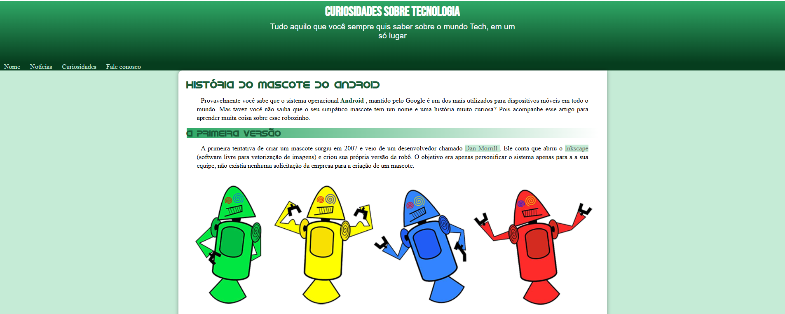

# 🤖 Projeto Android - Curso de HTML e CSS

📱 Exercício prático feito durante o curso de HTML e CSS do Gustavo Guanabara, onde recriamos a página inicial do sistema Android.

## 📌 Sobre o Projeto | About the Project

Este projeto tem como objetivo praticar a estruturação de páginas web usando HTML e CSS, recriando o layout da página oficial do Android. O foco foi em semântica, estilos e responsividade.

---

This project aims to practice web page structuring using HTML and CSS, by recreating the official Android homepage layout. The focus was on semantics, styling, and responsiveness.

## 🛠️ Tecnologias | Technologies

- HTML5  
- CSS3  
- Git & GitHub

## 🎯 Funcionalidades | Features

- Layout fiel ao site oficial Android  
- Responsividade para dispositivos móveis  
- Uso de tags semânticas

---

- Layout faithful to the official Android site  
- Responsive design for mobile devices  
- Use of semantic tags

## 📷 Screenshot

 <!-- Substitua pela imagem real do projeto -->

## 🔗 Link do Projeto | Project Link

👉 [Veja o projeto online](https://leticiamaca.github.io/projeto-android)

## 🚀 Como Rodar Localmente | How to Run Locally

```bash
# Clone o repositório
git clone https://github.com/leticiamaca/projeto-android

# Acesse a pasta do projeto
cd projeto-android

# Abra o arquivo index.html no navegador
```
### 📚 Aprendizados | What I Learned
- Uso de HTML semântico

- Estilização com CSS moderno

- Layouts responsivos

- Use of semantic HTML

- Styling with modern CSS

- Responsive layouts

### 👩‍💻 Desenvolvido por | Developed by
Letícia de Castro Jacob Marques
GitHub Profile
